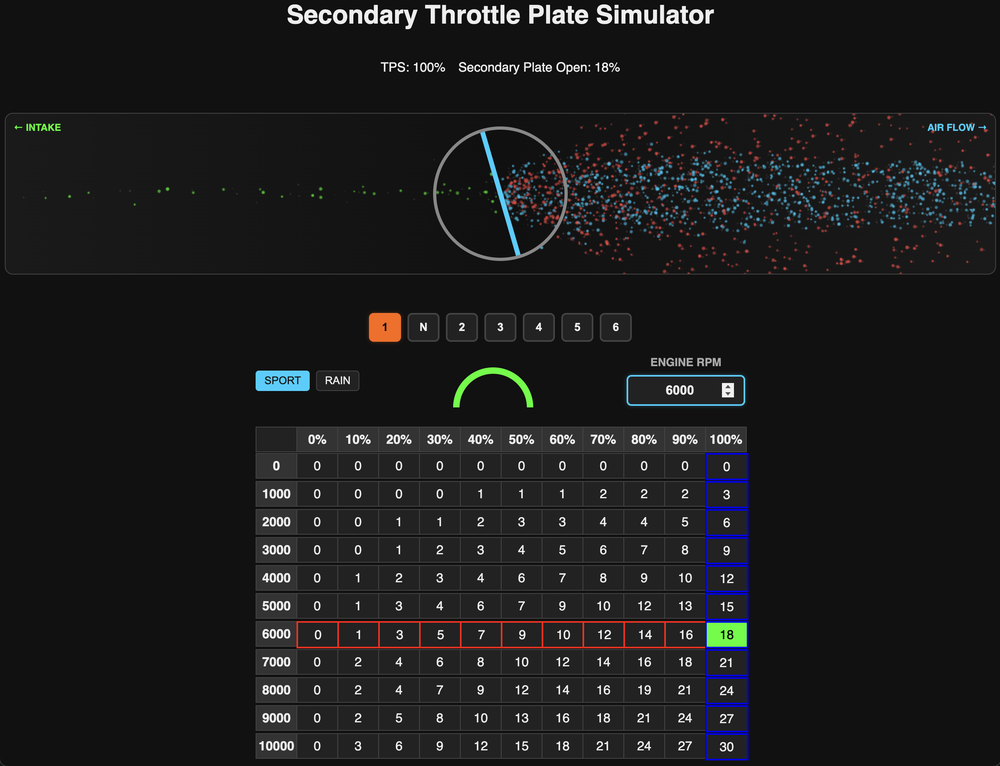

# Secondary Throttle Plate Simulator

A real-time web-based simulator for secondary throttle plates with realistic airflow visualization, gear selection, and driving mode controls. Can be used with or without Arduino hardware input.



## Features

- **🎮 Hardware Integration**: Optional Arduino potentiometer input for realistic TPS control
- **🌊 Real-time Airflow Visualization**: 2000+ animated particles showing air intake behavior
- **⚙️ 7-Speed Gear Selection**: 1, N, 2, 3, 4, 5, 6 with unique throttle maps per gear
- **🌧️ Driving Modes**: Sport and Rain modes with different throttle response characteristics
- **📊 Interactive Throttle Maps**: Visual grid showing secondary plate opening percentages
- **📱 Responsive Design**: Clean, automotive-themed interface

## Quick Start (Software Only)

1. **Clone the repository**

   ```bash
   git clone https://github.com/mytchdot/STP-Simulator.git
   cd STP-Simulator
   ```

2. **Install dependencies**

   ```bash
   npm install
   ```

3. **Run the simulator**

   ```bash
   node index.js
   ```

4. **Open in browser**

   ```bash
   http://localhost:3000
   ```

## Hardware Setup (Optional)

### Parts Needed

| Component                        | Description              | Quantity | Estimated Cost |
| -------------------------------- | ------------------------ | -------- | -------------- |
| Arduino Nano (any board is fine) | Microcontroller board    | 1        | $4             |
| 10kΩ Potentiometer               | Rotary variable resistor | 1        | $2             |
| Breadboard (optional)            | Half-size recommended    | 1        | $5             |
| Jumper Wires                     | Male-to-Male             | 3        | $1             |
| USB Cable                        | Arduino to Computer      | 1        | $1             |

### Wiring Diagram

```javascript
Arduino Nano         Potentiometer

5V      ────────────  VCC (outer pin)
GND     ────────────  GND (outer pin)
A0      ────────────  Wiper (center pin)
```

### Arduino Code

Upload this code to your Arduino:

```cpp
const int potPin = A0;

void setup()
{
  Serial.begin(9600);
}

void loop()
{
  int potVal = analogRead(potPin);
  Serial.println(potVal);
  delay(15);
}
```

### Hardware Configuration

1. **Upload Arduino Code**

   - Open Arduino IDE
   - Copy the code above
   - Select your Arduino board and port
   - Upload the code

2. **Update Server Configuration**

   In `index.js`, uncomment and configure the serial port section:

   ```javascript
   // Change these to match your setup
   const baudRate = 9600;
   let portPath = "/dev/cu.usbserial-XXXXXX"; // macOS/Linux
   // let portPath = "COM3";                    // Windows

   const port = new SerialPort({ path: portPath, baudRate: baudRate });
   const parser = port.pipe(new ReadlineParser());

   parser.on("data", (line) => {
     try {
       const data = JSON.parse(line);
       if (data !== undefined) {
         const tps = data / 10; // Scale 0-1023 to 0-102.3
         io.emit("tps", tps);
       }
     } catch (err) {
       console.error("Invalid JSON:", line);
     }
   });
   ```

3. **Find Your Serial Port**
   - **macOS/Linux**: `ls /dev/cu.*` or `ls /dev/ttyUSB*`
   - **Windows**: Check Device Manager → Ports (COM & LPT)

## How It Works

### Gear System

- **Gear 1 & N**: 30% throttle response (conservative)
- **Gear 2**: 50% response (moderate)
- **Gear 3**: 70% response (aggressive)
- **Gear 4**: 85% response (very aggressive)
- **Gear 5**: 95% response (near maximum)
- **Gear 6**: 100% response (maximum)

### Driving Modes

- **Sport Mode**: Full throttle response as per gear settings
- **Rain Mode**: 30% reduction in all values, capped at 60% maximum

### Airflow Visualization

- **🔵 Blue Particles**: Approaching the throttle plate
- **🟢 Green Particles**: Successfully passing through (intake air)
- **🔴 Red Particles**: Blocked by throttle plate (deflected air)

## Controls

| Control           | Function                             |
| ----------------- | ------------------------------------ |
| **Gear Buttons**  | Select transmission gear (1, N, 2-6) |
| **SPORT/RAIN**    | Toggle driving mode                  |
| **ENGINE RPM**    | Set engine RPM (0-10000)             |
| **Potentiometer** | Real-time TPS input (hardware mode)  |

## File Structure

```bash
STP-Simulator/
├── index.js              # Node.js server
├── package.json          # Dependencies
├── simple_tps.ino        # Arduino code
├── public/
│   └── index.html        # Web interface
└── README.md            # This file
```

## Troubleshooting

### Common Issues

**"Port not found" error:**

- Check Arduino is connected via USB
- Verify correct port path in `index.js`
- Try different USB cable/port

**No TPS response:**

- Check potentiometer wiring
- Verify Arduino code is uploaded
- Test with Arduino Serial Monitor first

**Particles not moving:**

- Check browser console for errors
- Ensure JavaScript is enabled
- Try refreshing the page

### Debug Mode

Enable debug logging in `index.js`:

```javascript
parser.on("data", (line) => {
  console.log("Raw data:", line); // Add this line
  // ... rest of code
});
```

## Dependencies

- **Node.js** 14+
- **Express** 5.1.0 - Web server
- **Socket.io** 4.8.1 - Real-time communication
- **SerialPort** 13.0.0 - Arduino communication
- **Arduino IDE** 1.8+ (for hardware setup)

## License

MIT License - Feel free to modify and distribute.

## Contributing

1. Fork the repository
2. Create a feature branch
3. Commit your changes
4. Push to the branch
5. Create a Pull Request

## Support

For issues or questions:

- Check the troubleshooting section above
- Open an issue on GitHub
- Verify all wiring connections for hardware setup

---

**Note**: The simulator works perfectly in software-only mode. Hardware integration is optional for enhanced realism.
